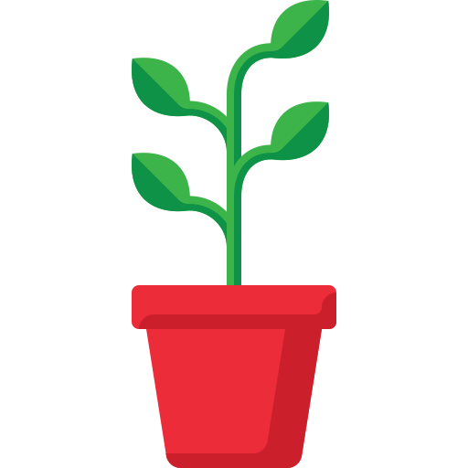
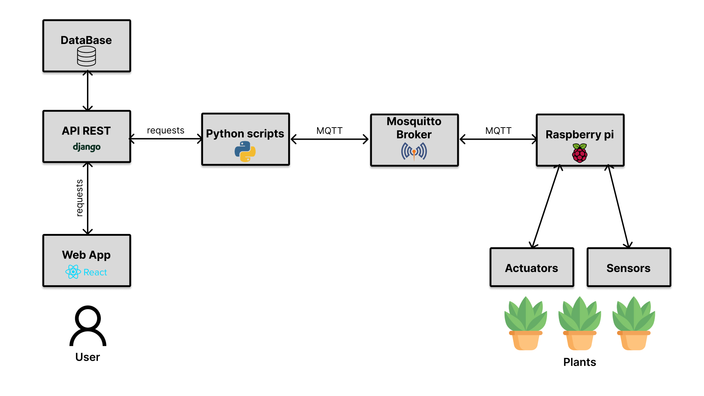

<h1 align="center"> Plants</h1>

 Monitor and take care of your plants (This project and this readme still a work in progress)  

  

<h3> List of features </h3>

<ul>
  <li>Plants' environment data collection and monitoring</li>
  <li>Direct order to actutor such as water pump and water atomizer</li>
  <li>Reports and charts (work in progress) </li>
  <li>Automation (work in progress)</li>
</ul>

<!-- <h3> Demo -> Show me what you got </h3>

<a href="#"> Link to your awesome Demo </a>

<a href="#"> Another Link to your awesome Demo </a> -->

<h3> Diagram </h3>

<h3>Authors or Acknowledgments</h3>
<ul>
  <li>Paul Verneuil</li>
</ul>

<h3>License</h3>

This project is licensed under the MIT License